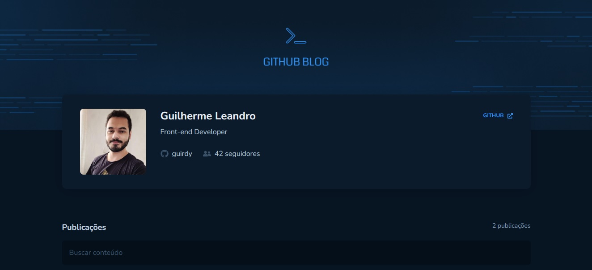

# Github Blog

This project is a front-end challenge provided by [Rocketseat](https://www.rocketseat.com.br) BootCamp Ignite.

Developed with `React`, `Typescript`, `Axios` and `Styled-Components`.

**React hooks used:**
- useContext
- useState
- useEffect

**APIs used:**
- [Github Users](https://docs.github.com/en/rest/users/users?apiVersion=2022-11-28#get-a-user)
- [Github Repos](https://docs.github.com/en/rest/repos/repos?apiVersion=2022-11-28#get-a-repository)

  

<h4 align=center>Developed by <a href="https://www.linkedin.com/in/guirdy/">Guilherme Leandro</a> 💻</h4>
